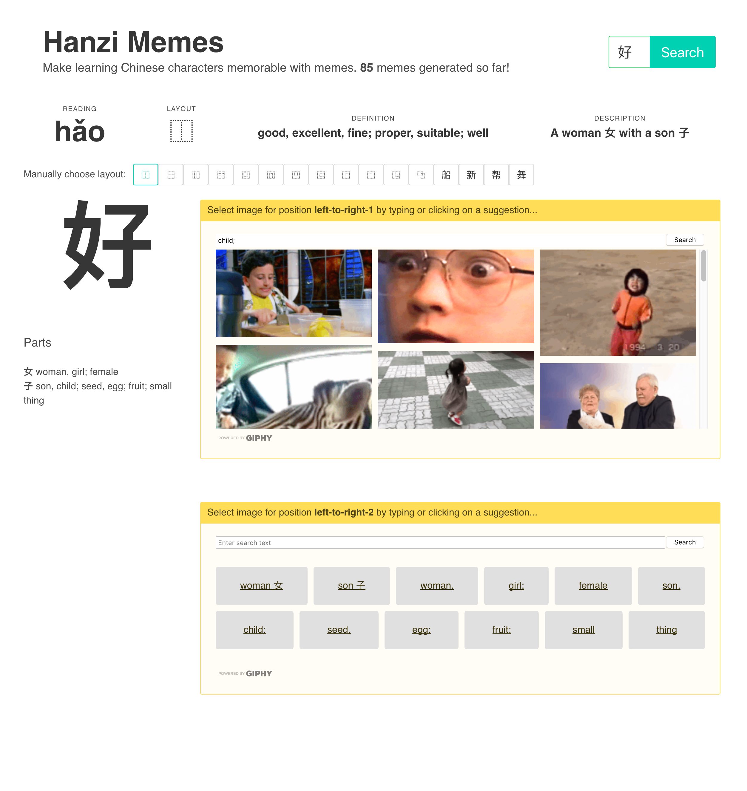
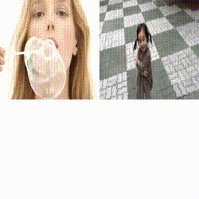

# Hanzi memes

[Live demo](https://hanzimemes.herokuapp.com) (might take half a minute to load for the first time, since it's hosted on a free dyno on Heroku)

## Summary

Learning Chinese characters is generally considered a difficult task, but can be made easier by first dissecting the characters into parts (called radicals) and understanding the meaning behind those parts. The goal of this webapp is to allow the user to quickly create animated GIF images that display the parts in a memorable way, which can then be inserted into a flashcard system.

## Motivation

When learning the character for 好/hao3/good, one might be tempted to just memorize the strokes without any context.

However, learning thousands of characters as if they were completely unrelated to each other will become very tedious, as characters can get quite complex: 警/jing3/alarm.

We must thus approach learning characters methodically.

The method here is to consider a Chinese character to be a combination of smaller parts, rather than a single large unit.

For example, 好/hao3/good consists of the radictals 女/nv3/mother and a 子/zi3/child, put together next to each other in a left-to-right layout. Our 警/jing3/alarm can also be dissected into 艹， 句，攵 and 言.

I like to compare Chinese "characters" to "words" in Western languages. The word "eat" consists of E, A and T, just like 吃 consists of three parts. Often, there will be one part relating to the pronounciation of the character, and another to the meaning. Characters with similar meanings will often have a common parts, such as 河, 江 and 酒, which all have to do with water, and thus share the three strokes on the left side.

From this perspective, one might even consider Chinese characters to be EASIER than Western words, as words like water, ice, sea, or drink have no apparent relation to a language learner.

So let's use this to our advantage!

## Problem

Learning lots and lots of characters takes a long time, which only gets longer if one must spend additional time per character dissecting it into parts, which usually involves looking the character up in a dictionary. Furthermore, to the average learner, it might not be clear how exactly to save the information about parts to look it up later.

## Solution

This webapp allows the user to instantly generate animated GIF images based on the parts of a character and how the parts are laid out. The user can input a character, which is then searched in the database (source: Unihan - http://unicode.org/charts/unihan.html,
CJKlib - https://github.com/cburgmer/cjklib and https://github.com/skishore/makemeahanzi).

The database suggests a layout, such as left-middle-right, and keywords for each of the part. The user can then quickly search for those keywords on GIPHY, a GIF image search engine, and insert the desired GIF into the right position. When all positions are filled, a combined GIF is generated.

I chose animated GIFs because they are by far the most memorable medium. I suggest, however, to take the time to "invent" a story for each Hanzi GIF, as this will further help with memorization. Take this GIF for 好 as an example:

One could remember that the mother (left) of the child (right) was blowing bubbles and this made the day a GOOD day. As you can see, nothing overly complex, but even this will help a lot.

## TODO

- Update code to use .env variables
- Adjust GIF speed (a bit to jumpy currently)
- Advertise project a bit
